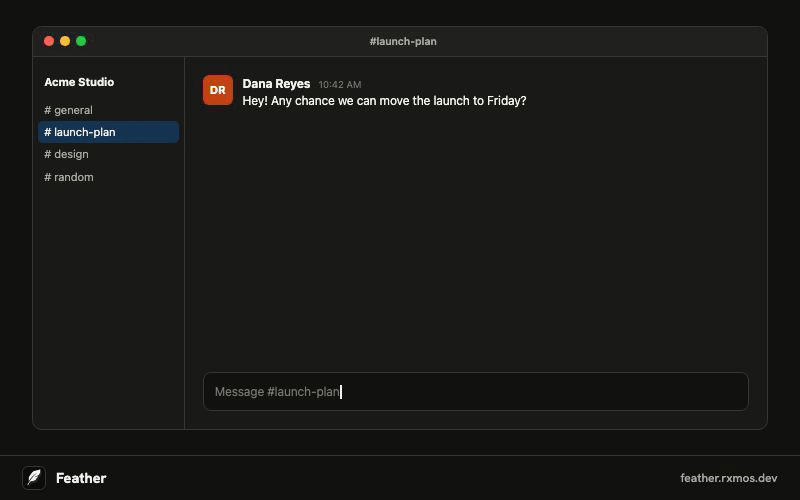
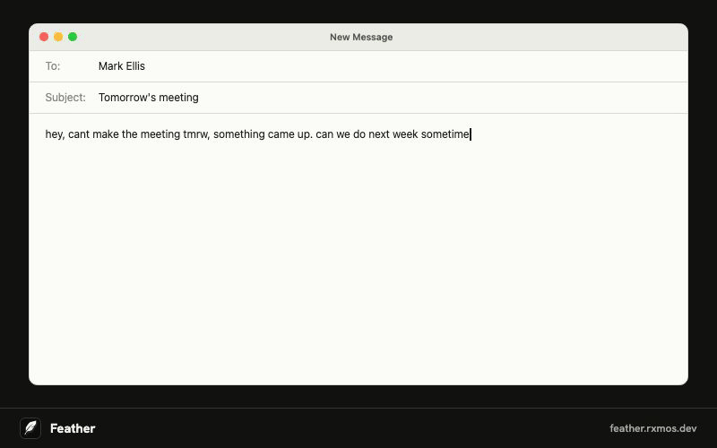
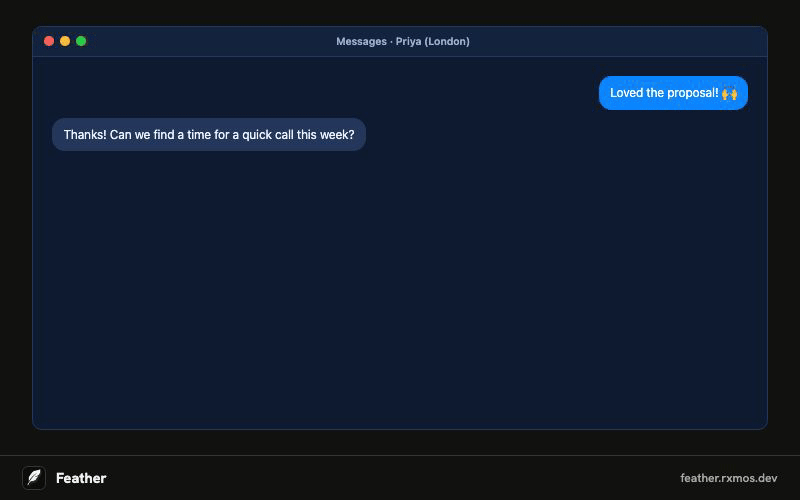

<p align="center">
  
</p>

<h1 align="center">Feather</h1>

<p align="center">
  <strong>Press a shortcut. Tell your computer what to write.</strong><br>
  An AI writing assistant for Mac, Windows, and Linux that drafts replies from what's on your screen.
</p>

<p align="center">
  <a href="https://feather.rxmos.dev/download"><strong>Download</strong></a> ·
  <a href="https://feather.rxmos.dev">Website</a> ·
  <a href="https://github.com/yurirxmos/feather/releases">Releases</a>
</p>

<p align="center">
  <a href="https://github.com/yurirxmos/feather/releases/latest"></a>
  
  <a href="LICENSE"></a>
</p>

<p align="center">
  
</p>

While working in any app, press `⌥ Space`, describe what you want to write, and Feather generates
it from the context around your cursor. Press `Return` (`Enter` on Windows and Linux) again to
paste it into the field you were using.

> Reply that I can do tomorrow at 2 pm, in a formal tone.

- **Works in any app:** chat, email, docs, browser forms. No plugins or copy-paste.
- **Reads the context for you:** the focused field, selected text, the window's text, and
  optionally a screenshot.
- **Refine as you go:** follow up with "shorter" or "more casual," regenerate, or copy instead.
- **Private by design:** nothing is captured until you press the shortcut, and screen context is
  discarded when the panel closes.
- **Bring your own model, or don't:** use your OpenAI, Claude, or OpenCode Go API key
  for free, or Feather Plus with no key at all.
- **Native and open source:** SwiftUI on macOS (`Sources/`), Tauri on Windows and Linux
  (`desktop/`), MIT licensed.

<table>
  <tr>
    <td></td>
    <td></td>
  </tr>
  <tr>
    <td align="center">Rewrite a rough draft</td>
    <td align="center">Answer with what's on screen</td>
  </tr>
</table>

It lives in the menu bar on macOS and in the system tray on Windows and Linux. The two apps stay in
parity.

## How it works

When you invoke Feather, it captures the available context from the frontmost
app and sends it with your instruction to the selected provider. Context can
include:

- App and window name
- Text in the focused field and selected text
- Readable text from the active window
- A screenshot of the active window, when enabled

The reply streams into Feather's panel. You can insert it, copy it, regenerate
it, or keep writing an instruction to refine it.

Nothing is captured until you press the shortcut, and screen context is
discarded when the panel closes. To let you bring back a recent conversation
with ↑, Feather keeps your last 5 instructions and replies in a file on this
computer only; it never saves screen context there. Feather logs generation
timings only; it does not log screen contents, instructions, or responses.

## Providers

Set up a provider in **Feather > Settings > Connection**. Providers you have set up are listed
first, with the one in use marked; click **Use** to switch. The first one you set up is used right
away, and removing the one in use switches to another that is set up.

### Feather Plus

Feather Plus is the hosted option: no API key needed. Click **Set Up…** next to Feather Plus in
**Settings > Connection**, sign in with a one-time email link, and pick a plan. The account and
usage are in **Settings > Feather Plus**.

| Plan | Price | Includes |
| --- | --- | --- |
| Plus Monthly | $4/month | Hundreds of replies a month |
| Plus Yearly | $36/year | Hundreds of replies a month, renewed every month |

Both are the same Feather Plus, billed differently. Each month includes a set amount of model
use, shown in Settings as a percentage used. Feather never stores your instructions, screen
context, or replies; they pass through its server to the model provider, which handles them
under its own data policy. Only your email, plan, and request, token, and cost counts are kept.

Bringing your own OpenAI, Claude, or OpenCode Go API key stays free.

### Claude

Claude uses the Anthropic Messages API. Paste a Claude API key from the
[Claude Console](https://console.anthropic.com) in Settings, then select a model. The default
model is `claude-haiku-5-5`.

Your API key is stored in the macOS Keychain. Usage is billed to your Anthropic account.

### OpenCode Go

OpenCode Go uses its OpenAI-compatible streaming API. Paste an OpenCode Go API
key in Settings, then select a model from the available-model list. The default
model is `deepseek-v4.1-flash`.

Your API key is stored in the macOS Keychain. Model availability and usage are
managed by your OpenCode subscription.

### OpenAI

OpenAI uses the Chat Completions API. Paste an OpenAI API key from the
[OpenAI Platform](https://platform.openai.com/api-keys) in Settings, then select a model. The
default model is `gpt-5.4-mini`.

Your API key is stored in the macOS Keychain. Usage is billed to your OpenAI account.

## Setup

1. Launch Feather from the menu bar.
2. Open **Settings > Connection** and set up Feather Plus, OpenAI, Claude, or OpenCode Go.
3. Grant the required permissions:
   - **Accessibility** lets Feather read the focused field and paste a result.
   - **Screen Recording** lets Feather capture the active-window screenshot.
4. Choose a shortcut and, optionally, configure writing preferences or disable
   screenshots.

Screen Recording is required by the current permissions flow even when the
screenshot option is disabled. Relaunch Feather after granting it.

## Download

[feather.rxmos.dev/download](https://feather.rxmos.dev/download) picks the right file for your
system. Every build is also published on the
[GitHub Releases](https://github.com/yurirxmos/feather/releases) page:

- `Feather-<version>-arm64.dmg` for Apple Silicon Macs, macOS 14 or later
- `Feather-<version>-x86_64.dmg` for Intel Macs, macOS 14 or later
- `Feather-<version>-windows-x64-setup.exe` for Windows 10 or later, 64-bit
- `Feather-<version>-linux-x86_64.AppImage` for Linux

The Mac builds are signed with an Apple Developer ID and notarized by Apple, so
they open like any other app downloaded from the internet.

After Feather opens, grant **Accessibility** and **Screen Recording** in its
Settings page. You can also grant them manually in **System Settings > Privacy
& Security > Accessibility** and **Screen Recording**. Quit and reopen Feather
after granting Screen Recording.

Feather checks for updates on launch and every hour. When a new version is out it
asks before installing, and the permissions carry over. You can also choose
**Check for Updates…** from the menu-bar icon.

### Code signing policy

Free code signing for the Windows installer is provided by [SignPath.io](https://signpath.io),
with a certificate from the [SignPath Foundation](https://signpath.org).

- **Authors, reviewers, and approvers:** [Yuri Ramos](https://github.com/yurirxmos) is the only
  maintainer and holds all three roles. Every release is built by the public
  [GitHub Actions workflow](.github/workflows/release-desktop.yml) from a `v*` tag, and signed
  only after it is approved.
- **Privacy:** Feather reads your screen context only when you press the shortcut, and sends it
  only to the provider you chose (OpenCode Go, OpenAI, Claude, or Feather Plus) to generate the reply.
  It transfers no other information to other networked systems, except the update check against
  GitHub Releases and feedback you choose to send from the menu, which carries only your message,
  the optional email you type, and the Feather and system versions.

## Keyboard shortcuts

### Global shortcut

The default shortcut is `⌥ Space`. Choose one of these presets in Settings:

| Shortcut | Action |
| --- | --- |
| `⌥ Space` | Open Feather (default) |
| `⌃ ⌥ Space` | Open Feather |
| `⇧ ⌘ Space` | Open Feather |
| `⌃ ⌥ ↩` | Open Feather |

### In the Feather panel

| Key | Action |
| --- | --- |
| `Return` | Generate a result, refine it with a new instruction, or insert it into the focused field when the field is empty |
| `⌘ Return` | Copy the result |
| `⌘ R` | Regenerate the result |
| `⌘ N` | Save this conversation and start a new one on the same screen |
| `↑` / `↓` | With an empty field, bring back one of the last 5 conversations |
| `Esc` | Stop a running reply, or close Feather (`↑` brings the conversation back) |

To add more of the same window, press the shortcut (or click the window) to hide Feather, scroll,
and press the shortcut again within a minute: Feather reads the screen again and keeps the
conversation. In another app, or after a minute, it saves the conversation for `↑` and starts fresh.

Feather never pastes into a password field: it copies the result instead and says why, as it does
when it lacks permission to paste. If the app has closed since you pressed the shortcut, it keeps
the panel open so you can copy the result.

## Build from source

Requirements:

- macOS 14 or later
- Xcode 15 or later

From the repository root:

```sh
swift build
swift test
scripts/bundle.sh          # produces dist/Feather.app
open dist/Feather.app
```

The bundle script uses ad-hoc signing by default. macOS ties Accessibility and
Screen Recording grants to the code signature, so use a stable signing identity
while developing to retain those permissions between builds:

```sh
CODESIGN_IDENTITY="Apple Development: Your Name (TEAMID)" scripts/bundle.sh
```

Set `VERSION` to override the app version embedded in the bundle:

```sh
VERSION=1.0.0 scripts/bundle.sh
```

Local builds leave the updater off. To publish a release, push a version tag; the
`Release macOS` workflow builds both architectures, signs them, and publishes the
disk images with a signed Sparkle feed per architecture:

```sh
git tag v0.1.7 && git push origin v0.1.7
```

## Development

`FeatherCore` contains the pure, testable logic for prompt construction,
provider requests, and server-sent-event parsing. The `Feather` target contains
the macOS app, including the menu-bar UI, permissions, hotkey, screen capture,
and text insertion.

Run the unit tests with:

```sh
swift test
```

AppKit, Accessibility, and ScreenCaptureKit behavior should also be verified by
running the bundled app.

## License

Feather is released under the [MIT License](LICENSE).
